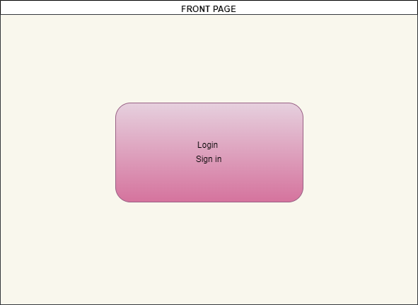
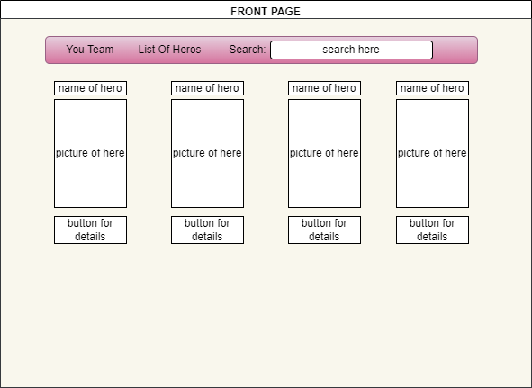
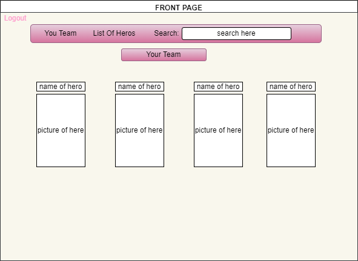
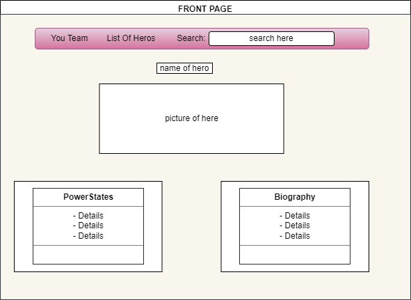
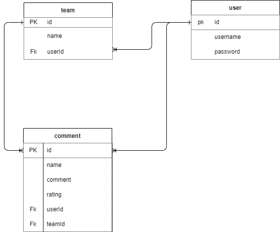
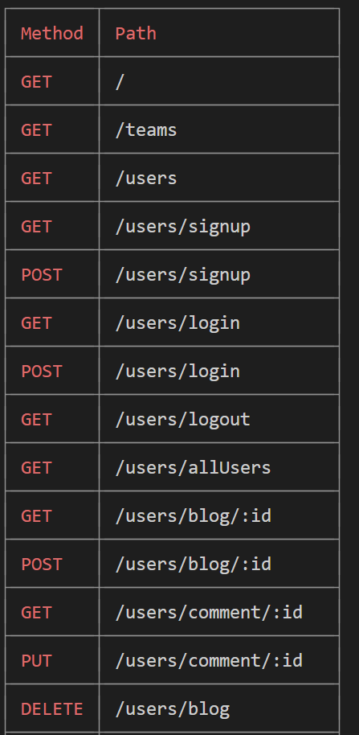
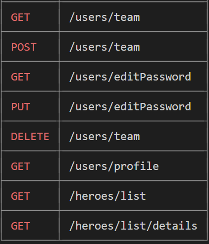

# Super_Hero Read Me
## Project Idea and Decription
- My idea is to create a app that allows user to enter the app with a username and password 
- The user will have a list of super_heros that they can search up by using the search bar 
- They can enter that heros details page and look at there details
- The user can add a hero to there team 
- They can also enter a community page where they can look at other users teams and comment on them

## API
- https://gasei.gitbook.io/sei/11-projects/project-2 

## LINK TO SITE 
https://super-hero-website.herokuapp.com/

## Wireframe

## ERDs

## Restful Routing Chart

## User Stories
- As a user, I want to login so that i can look at the heros
- As a user, I want sign up so that i can create an account
- As a user, I want to press on a spacific hero so that i can look at the details about that hero
- As a user, I want press on a the My teams button so that i can look at my teams 
- As a user, I want to press on the add button(forgot to add in the frame work) in the details page so that i can add it to my team
- As a user, I want to press on the list of heros button to look at all the heros 
- As a user, I want be able to search for a spacific hero so that i can find the hero i want
- As a user, I want to press on the logout button so that i can log out
- As a user, I want to press hte delete button in the teams page to remove a hero from the team so that i can edit my team

## MVP goals
- login: 
- logout
- sign up: create new user 
- create a comment
- update a comment  
- delete a comment 
- look at a details page
- add a list of heros through an API with name and img

## Stretch Goals
- create a team
- add to team
- delete from team 
- style the pages
- look at your team 
- search for a spacific hero 
- post the team you made to a blog tab

